# EKAW'2026

[25th International Conference on Knowledge Engineering and Knowledge Management](https://ekaw2026.di.unito.it/), September 29 - October 1, Turin (Italy)

* Author: Fanfu
* [Program](https://ekaw2026.di.unito.it/program-overview)
* [Accepted papers](https://ekaw2026.di.unito.it/accepted-contributions/papers)
* 25th edition of EKAW
* Research Track: 108 PC members, 274 reviews, 3+ reviews / paper
* Accepted: 16 Research, 2 In-Use, 5 Vision papers
* Special theme: **New Frontiers in Knowledge Engineering**

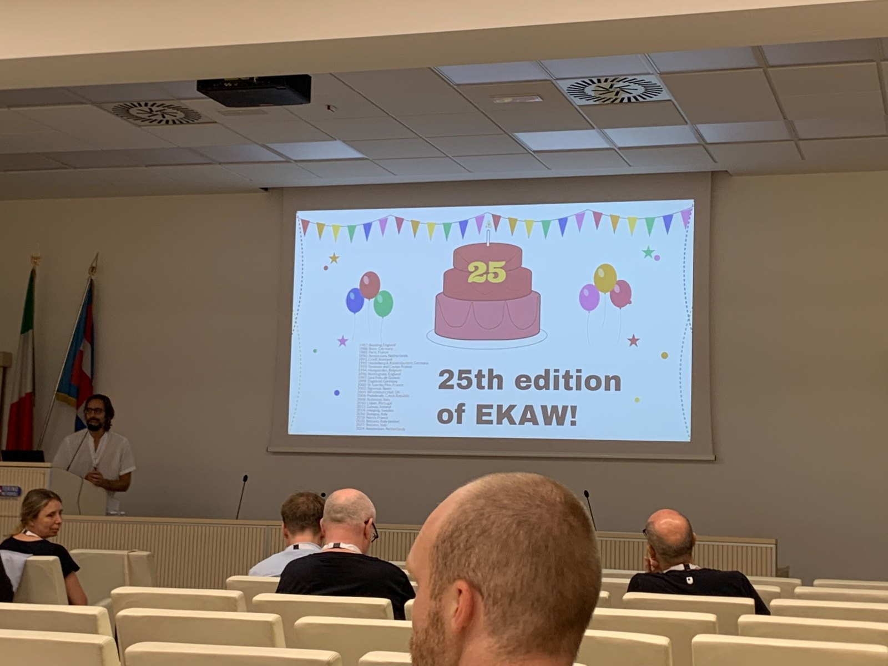

## To Do / To Watch / Random Notes

* **KONTRAST** - I presented *Detecting Knowledge Inconsistencies Across Text, Tables, and Knowledge Graphs* in the Reasoning and Repair session.
  * Main idea: compare answers grounded in Wikipedia tables with answers retrieved from Wikidata, then categorize the disagreements.
  * Nice discussion around what an inconsistency really means when sources evolve independently.
  * Paper / code: <https://github.com/ecladatta/KONTRAST>

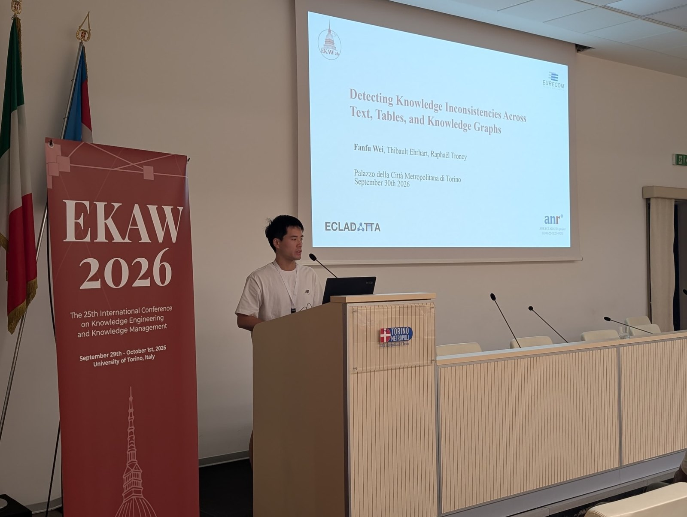

* **Paul Groth cited KONTRAST in his keynote** - very relevant for the direction of ECLADATTA.
  * Two consecutive slides were especially close to our work: **"Tables are often Multimodal"** (Liu et al., 2023) and **"Representations are inconsistent"** (KONTRAST).
  * His point was broader than inconsistency detection: representation, placement and architecture are intertwined; we need to decide which representation should be authoritative, how disagreement is represented, and how corrections propagate.
  * Paul explicitly welcomed further exchange in Amsterdam.

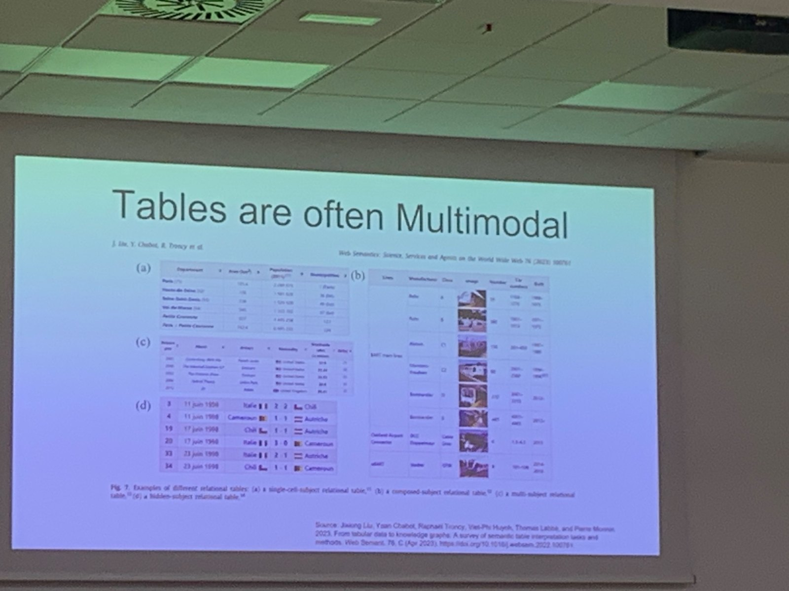

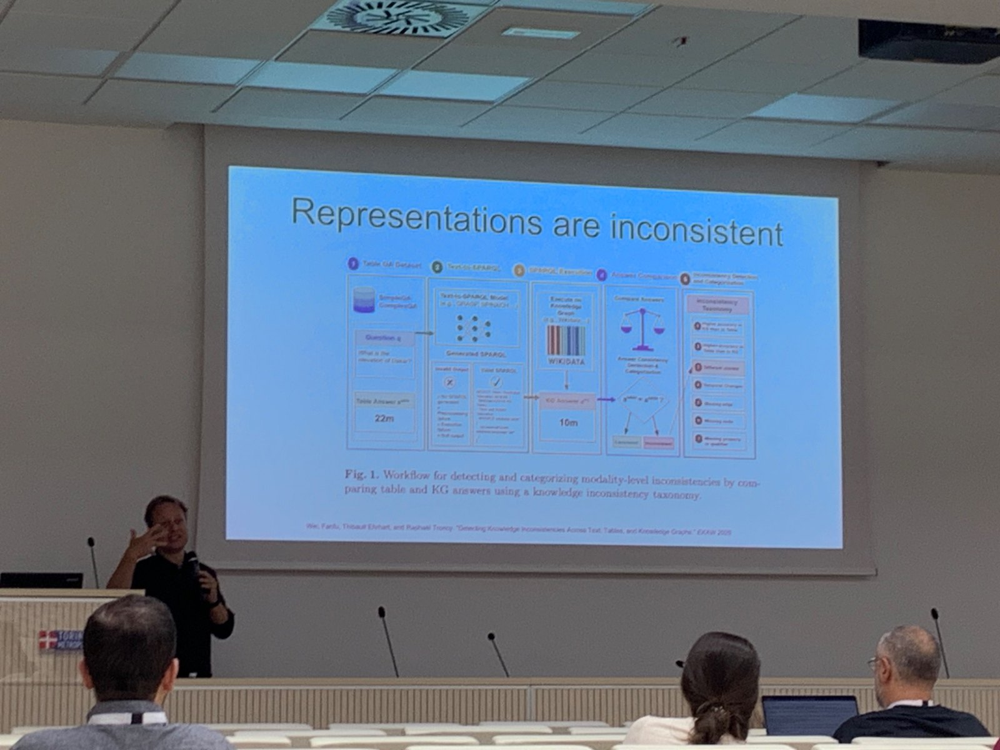

* **MARS: Multi-hop Adaptive Retrieval and SPARQL Generation for KGQA** - MUST STUDY for **Fanfu**.
  * Paper: <https://arxiv.org/abs/2607.14561>; code: <https://github.com/dice-group/mars-kgqa>
  * Instead of letting an agent freely explore the KG, MARS follows a fixed pipeline: entity linking -> retrieve/rank graph patterns -> LLM reasoning -> either expand another hop or generate SPARQL.
  * Important detail: it retrieves **patterns rather than raw triples**, keeping the context small; the depth adapts to the question while the procedure stays fixed.
  * No dataset-specific fine-tuning. Evaluated on QALD-9-plus, QALD-10 and LC-QuAD2.0.
  * Best Macro-F1 on all four QALD-10 languages and on LC-QuAD2.0; on QALD-9-plus it splits the language wins with GRASP.
  * Interesting comparison with GRASP: for these multi-hop questions, the paper finds that a fixed planning-oriented pipeline can outperform a tool-selecting agent.
  * Main remaining errors are engineering-like: result truncation, ASK / COUNT projection, and overly conservative literal generation.

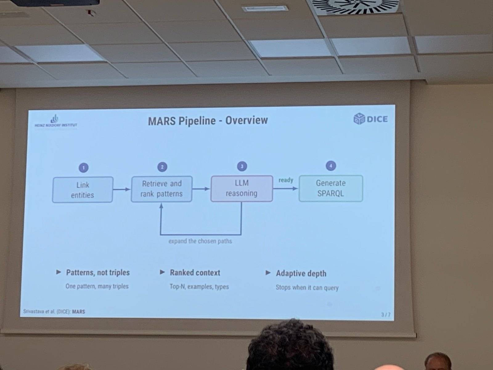

* **EMERGE: A Benchmark for Updating Knowledge Graphs with Emerging Textual Knowledge** - MUST STUDY for **ECLADATTA**.
  * Paper: <https://arxiv.org/abs/2507.03617>; code: <https://github.com/klimzaporojets/emerge>
  * Accepted at NeurIPS 2026 Datasets & Benchmarks.
  * The problem is not simply extracting triples from text, but deciding how new textual evidence should **update the current KG state**.
  * 376K Wikipedia passages aligned with 1.25M KG edits across 10 Wikidata snapshots (2019-2025).
  * Operations include **Exists, Add, Mint+Add, Infer, Deprecate**.
  * This feels extremely close to the next step after KONTRAST: not only *detecting* that Wikipedia and Wikidata disagree, but understanding whether and how the KG should change.

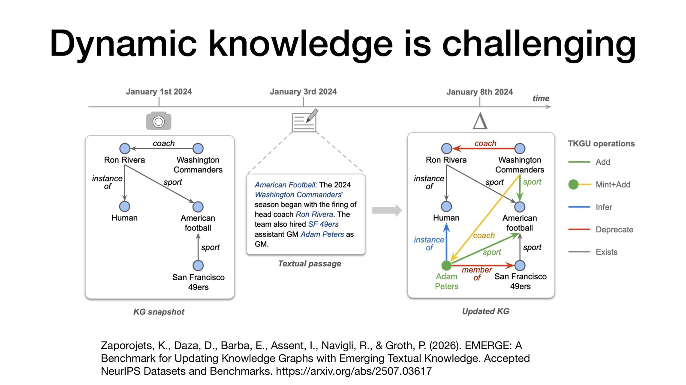

* [PixelRAG](https://pixelrag.ai/) - interesting example of keeping information in its visual representation instead of forcing everything into text / triples first. It searches Wikipedia through rendered screenshots.
* [Never-Ending Learning for Agentic AI Systems tutorial](https://megagon.ai/agentic_tutorial2026/) - useful material on dynamic knowledge, memory, drift and continuously changing systems.
* Poster worth keeping: **WebNLG-IR** - multilingual retrieval over triples, verbalized text and hybrid representations. Their main result is that concatenating triples + verbalized text performs best; text alone underperforms.
* Poster worth keeping: **Spygame / QUILL** - evaluate generated knowledge cues through actual human reasoning rather than only automatic text metrics.

## September 29 - X-TAIL Workshop

* [X-TAIL: eXtraction and eXploitation of long-TAIL Knowledge with LLMs and KGs](https://www.xtail-workshop.org/)
* I only attended X-TAIL on the workshop day.

### **Keynote: Rossana Damiano - Narrating Cultural Data: Opportunities and Challenges**

* Why storytelling? Compact, effective, easier to remember; also connected to identification, emotion and narrative self.
* Cultural data are **sparse, fragmented and heterogeneous**, and often need historical / social / cultural context to become understandable.
* Interesting ideas around citizen curation, intangible cultural heritage, remediation and the role of interactivity.
* Typical pipeline mentioned around museum data: NER -> Entity Linking -> Relation Extraction.
* Moving from data to stories still requires data cleaning, and human evaluation is often missing.

### **Long-tail knowledge from historical sources**

* Jude Majumdar and Delfi Sol Martinez Pandiani - *All Present, None Accounted For: Named Entity Extraction as Diagnostic for Long-Tail Knowledge in Historical Archives*.
  * Historical archives are a hard long-tail setting: scanned / handwritten Dutch material, noisy and unstructured text, rare entities.
  * Nice framing: use NER performance itself as a diagnostic for what knowledge current models fail to cover.
* Stella Verkijk and Piek Vossen - *ROBE: Reversed-Order-Biased-Experts for Extracting Extreme Long-tail Events in Historical Texts*.
* Sandro Gepiro Contaldo et al. - *MultiAgent-Constructed Knowledge Bases for Long-Tail Microbial Question Answering*.
* Tijn Donners and Franziska Pannach - *From Travelogue to Knowledge Graph: An End-to-End Pipeline with Open-Weight LLMs for 19th-Century Dutch Travel Narratives*.

### **Ontology card game with Max Willis**

* Fun hands-on ontology modelling exercise: concepts and relations can be replaced / mixed into the current model as the game evolves.
* The cards included concepts such as GIS, surveillance camera, community meeting, warehouse, abandoned area, etc., with relations such as *located in*, *has participant*, *has quality*, *depends on*.
* Nice concrete reminder that ontology modelling is not only technical: people negotiate what concepts matter and how they relate.

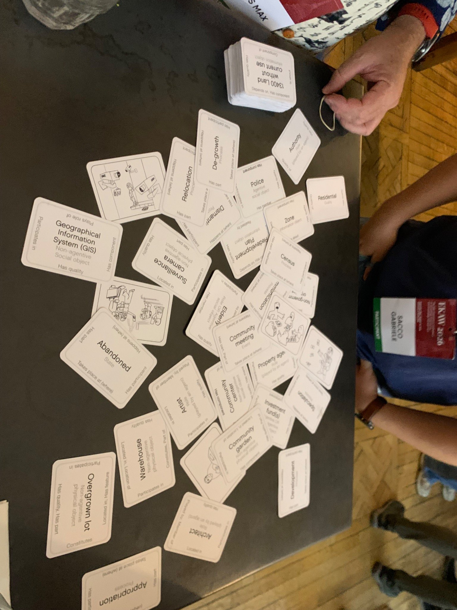

## September 30 - Main Conference Day 1

### **Opening**

* EKAW celebrated its 25th edition.
* Raphaël was included in the anniversary testimonials: **"a vibrant, welcoming community that made a young researcher feel he belonged"** and that EKAW has a special place in his heart.
* Research topics were still centered on **Knowledge Graphs**, with LLMs, Knowledge Engineering, Cultural Heritage, Ontology Engineering and Agentic AI also prominent.

### **Keynote: Irene Celino - The Hitchhiker's Guide to Knowledge Engineering**

* Main warning: Knowledge Engineering should not become only a technical recipe for grounding GenAI.
* Knowledge remains connected to people, practices and goals even after it is encoded as an ontology / KG / digital artifact.
* Hybrid systems therefore need to consider human interpretation, judgement and responsibility, not only representation and automation.
* This theme came back repeatedly on Day 2.

### **Session 2: Engineering Knowledge with Language Models**

* Virginia Ramón Ferrer et al. - *Easy to Say, Hard to Recover: Evaluating Structured Knowledge Preservation in Lightweight Language Models for Multilingual RDF-Text Cycles*.
  * RDF -> text is easier than text -> RDF: models verbalize structured knowledge better than they reconstruct exact triples.
  * Meaning is preserved better than structure.
  * Multilingual degradation is uneven; fine-tuning helps but does not fully remove the gap.
  * This was one of the Best Research Paper nominees.

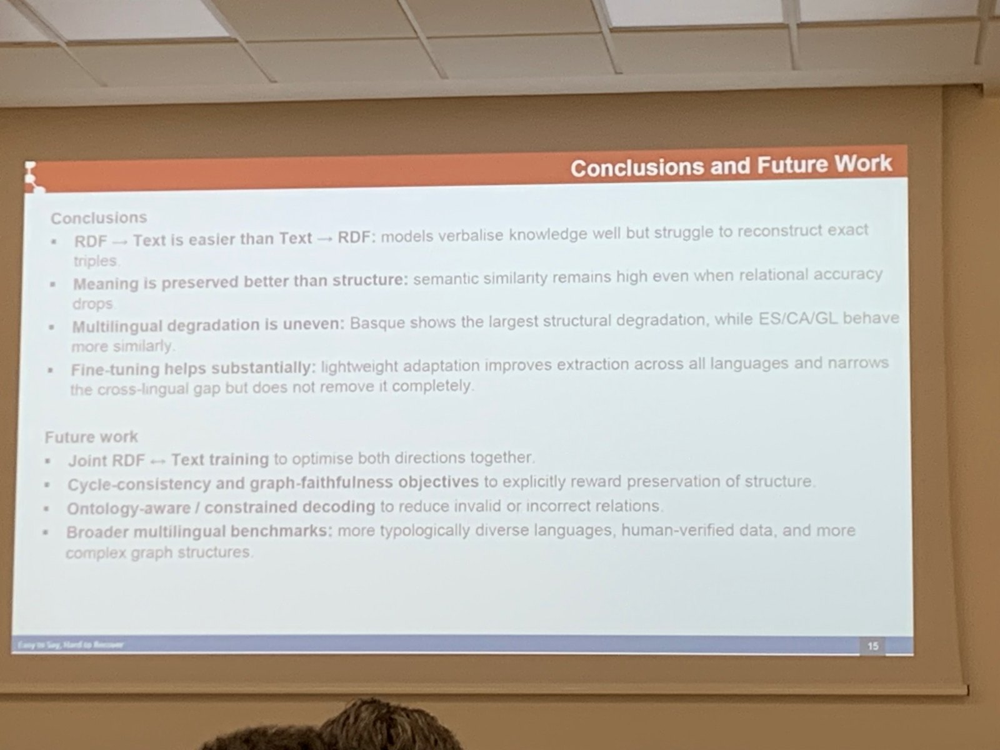

* Ruben Peeters et al. - *LLM-based Knowledge Graph Construction for Cultural Heritage: An Extraction-Failure Diagnostic and CIDOC-CRM Benchmark*.
  * Compared a single-prompt baseline with an agentic pipeline split into NER, coreference, entity linking, relation extraction and ontology mapping.
  * Added iterative checks / repair with DbC and SHACL.
  * Interesting because the evaluation looks at *where KG construction fails*, not only final triple scores.

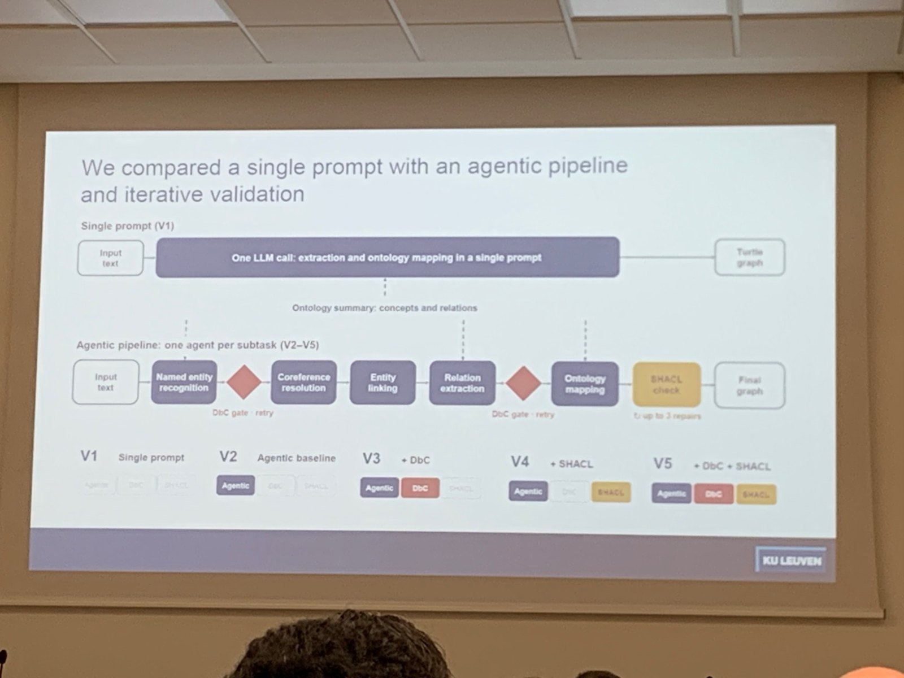

### **Session 3: Intelligent Question Answering and Knowledge Discovery**

* **MARS** - see the detailed note at the top. This was one of the Best Research Paper nominees.
* Rachele Mignone et al. - *The Missing Link: Why Legal Large Language Models Need Knowledge Graphs*.
  * Broad argument for explicit structured legal knowledge to improve grounding, traceability and reasoning around legal LLMs.

### **Session 4: Reasoning and Repair**

* Daira Pinto Prieto et al. - *Enabling Formal Epistemic Reasoning in Diagnostic Systems using Semantic Technologies*.
  * Epistemic context can guide diagnostic reasoning, but explicit epistemic logic is costly to model and compute; Semantic Web technologies are used to mitigate part of that cost.
* José C. Oliveira et al. - *Guiding Ontology Repair with Axiom Weakening and Inconsistency Power Indices*.
* Siddharth Bhargava et al. - *Have You Been Convinced? A Neuro-symbolic Argumentation Reasoning Approach to Detecting Persuasiveness in ChangeMyView Discussions*.
* **Fanfu Wei et al. - KONTRAST** - my presentation; see the note at the top.

### **Posters / Demos**

* **WebNLG-IR: Triple, Text, and Hybrid Retrieval over Multilingual Knowledge Graphs**.
  * 35,616 queries; compares BM25, dense / multivector retrieval and MILCO across triples, text and hybrid representations.
  * Main takeaway: triples and text provide complementary signals; **triples + verbalized text (concat)** works best across settings.

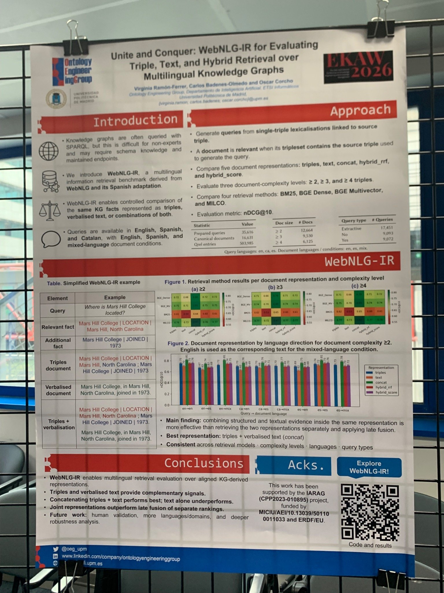

* **Spygame: Human-in-the-Loop Evaluation of Generated Knowledge Cues**.
  * 45 target public figures, 360 cues, 3,412 cue-level interactions.
  * A cue can be factually correct and fluent but still useless because it is vague, obvious or ambiguous.
  * Nice way to evaluate generated knowledge **in use**, via observable human reasoning behavior.

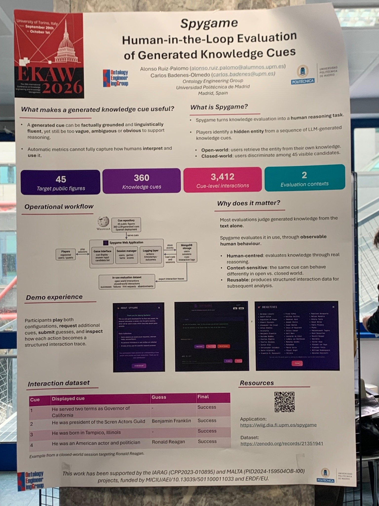

* *Towards Rich Data Queries From Schema Diagrams* - ViziQuer generates SPARQL from a GUI; the multicardinal table avoids Cartesian-product duplication for multi-valued properties.
* *Towards Automated Generation of Entity Graphs for Explaining False or Misleading Claims* - uses LLM-generated entity graphs to make fact-check explanations more structured; still sees relation / type modelling errors.
* *Deploying Sensemaking Robots in Healthcare Environments* - perception + ontology / KG reasoning + anomaly rules; large gap between synthetic and noisy real-world precision.

## October 1 - Main Conference Day 2

### **Keynote: Paul Groth - The Knowledge Placement Problem**

* Paul explicitly said the goal was to **raise questions rather than answer them**.
* Core question: *where should knowledge live?* Model weights, context window, retrieval index, agent memory, KG / database, tools, or people?
* LLMs make it easier to transform knowledge between representations, but these transformations are not free and can be lossy.
* **Requirements shape placement** - Paul's own preliminary qualitative matrix compares substrates by write/read, capacity, mutability, verifiability, attribution and composition.
  * Useful questions: How often does the knowledge change? How often is it queried? What latency / cost / error can we tolerate? What must a correction reach?
* Nice research-assistant example:
  * document store -> versioned evidence and context;
  * retrieval index -> passages linked to source versions;
  * KG -> qualified claims, sources and dependencies;
  * agent memory -> temporary working conclusions.
* **Provenance is the key building block**: track sources, transformations and downstream uses so we know what needs to change after a correction / retraction.
* KGs may become the **connective tissue** across heterogeneous stores rather than the only place where knowledge lives.
* Particularly relevant sequence for us:
  * knowledge is multimodal;
  * tables are often multimodal;
  * different representations can improve performance;
  * **representations are inconsistent** -> KONTRAST;
  * knowledge also changes with time -> **EMERGE**.
* His conclusion: foundation models do not reduce the scope of Knowledge Engineering; they make the playground much bigger.

### **Session 6: New Frontiers in Knowledge Engineering - Vision & Horizons**

* Very nice **fishbowl discussion**: people sit in a circle around 4-5 central chairs; to join the discussion, you tap someone in the middle and replace them.
* Terry Payne - **Discoverable Agent Knowledge / Agentic KG Affordances**.
  * Current KG metadata says what a KG contains, but not what a specific agent can actually prove or safely use for a task.
  * Proposes an Agentic Affordance Profile for KG selection / composition / failure diagnosis at planning time.
  * Nice connection to our MCP work: agents should know what a KG can afford before they start querying it.
* Greta Adamo / Max Willis - sustainability / justice modelling: start modelling from the perspective of vulnerable subjects, not only from what is technically convenient.
* Enrico Daga - **Knowledge Graph Re-engineering Along the Ontological Continuum**.
  * Tries to provide a principled way to describe and transform KGs with different modelling commitments rather than treating KG conversion as ad-hoc engineering.
* Irene Celino - **The Road to Knowledge Hell is Paved with AI Good Intentions**.
  * "Knowledge always remains human": formalizing knowledge does not remove tacit experience, interpretation or situated judgement.
  * Human Knowledge Interaction (HKI) as a lens with three dimensions: **knowledge form, cognitive processes, hybrid systems**.
  * Research directions: evaluation of digital knowledge, human-AI entanglement, governance of autonomous knowledge use.
* Stefan Schlobach / Neal Harris / Pascal Hitzler - **Dialectics of Knowledge / Critical Symbolic AI**.
  * Broader point from the discussion: KE needs room for disagreement, competing perspectives and social-science viewpoints, especially in a community that can otherwise become internally consistent around the same assumptions.

### **Session 7: Socio-technical aspects of Knowledge Engineering**

* Recurring theme: **the role of humans in knowledge modelling** - who defines the entities, identifiers, exceptions and boundaries, and what gets lost when these choices are formalized?
* Zeno van Cauter et al. - qualitative study of entities / identifiers / identification in industrial manufacturing; reminds us that identity decisions in a KG are partly organisational decisions.
* Alonso Ruiz-Palomo and Carlos Badenes-Olmedo - **QUILL**: evaluate whether LLM-generated knowledge cues actually help human deductive reasoning.
* Gabriele Sacco et al. - *Formal and Human Reasoning with Exceptions*.
* Anna Wróbel, Elia Meregalli and Stefan Schlobach - *How to unravell implicit power relations in symbolic AI research*.
  * **Best Research Paper Award**.
  * Strong reminder that modelling is not neutral; broader / different perspectives are needed, including perspectives from social science.

### **Session 8: Knowledge Engineering in Practice**

* Mario Scrocca et al. - *End-to-end Procedural Knowledge Management in Industry 5.0 with AI-in-the-loop*.
  * Connects human procedural knowledge, symbolic representations and AI support in an industrial setting.
* Michele Colombino et al. - *Enriching Cultural Heritage Knowledge Graphs from Historical Travel Narratives*.
  * Another concrete example of extracting structured knowledge from historical narrative sources, connecting back nicely to X-TAIL.

### **Awards**

* Best Research Paper nominees:
  * *Easy to Say, Hard to Recover: Evaluating Structured Knowledge Preservation in Lightweight Language Models for Multilingual RDF-Text Cycles*
  * **MARS: Multi-hop Adaptive Retrieval and SPARQL Generation for KGQA**
  * **Winner:** *How to unravell implicit power relations in symbolic AI research*

## Main Takeaways for ECLADATTA

* **KONTRAST -> EMERGE feels like a natural progression**: inconsistency detection tells us *where representations disagree*; dynamic KG updating asks *what should change next*.
* **Text-to-SPARQL is moving toward constrained / structured exploration**, as illustrated by MARS. This is directly useful when positioning GRASP and our MCP approach.
* **Representation choice is becoming part of the research problem**: text, tables, images, KGs, retrieval indexes and model parameters each preserve different things.
* **Provenance + time should probably become first-class in our next work** if we want to move from detecting differences toward maintaining reliable knowledge.
* EKAW's socio-technical discussions were a useful counterweight: a technically consistent KG is not automatically the right representation of reality, and disagreement is not always an error to remove.
