# EKAW'2026

[25th International Conference on Knowledge Engineering and Knowledge Management](https://ekaw2026.di.unito.it/), September 29 - October 1, Turin (Italy)

* Author: Fanfu Wei
* [Program](https://ekaw2026.di.unito.it/program-overview)
* [Accepted papers](https://ekaw2026.di.unito.it/accepted-contributions/papers)

* **Slides / presentation records on Zenodo:**
  * Keynote: The Hitchhiker's Guide to Knowledge Engineering: <https://zenodo.org/records/23056753>
  * Keynote: The Knowledge Placement Problem: <https://zenodo.org/records/23081694>
* Special theme: **New Frontiers in Knowledge Engineering**
* Research Track: 108 PC members, 274 reviews, 3+ reviews / paper
* Accepted: 16 Research, 2 In-Use, 5 Vision papers

## Highlights:

* **KONTRAST** - Fanfu Wei presented *Detecting Knowledge Inconsistencies Across Text, Tables, and Knowledge Graphs* in the Reasoning and Repair session. 

One question recevied is "Why/What motivates we use the different modalities?" Fanfu mention that we mean to use them to complement and correct each other. And they have different update cycles.

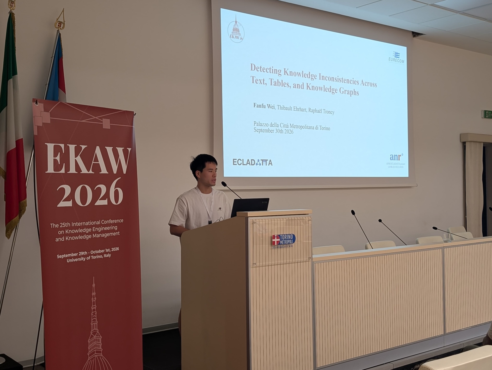

* **Paul Groth cited our work in his keynote**
  * In his keynote, he first used [From tabular data to knowledge graphs Survey](https://pmonnin.github.io/publications/liu-jows-2022.pdf) to make the point that **tables are often multimodal**, then used KONTRAST for **representations are inconsistent**.
  * Paul said this presentation is meant to raise questions, not answering them. He focus on knowledge placement problem, asking where knowledge should live, which representation is authoritative, and how corrections propagate across representations and substrates. 
  * Paul welcomed Fanfu for possible exchange in Amsterdam.

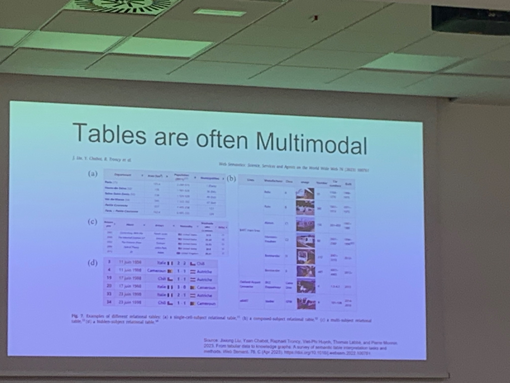

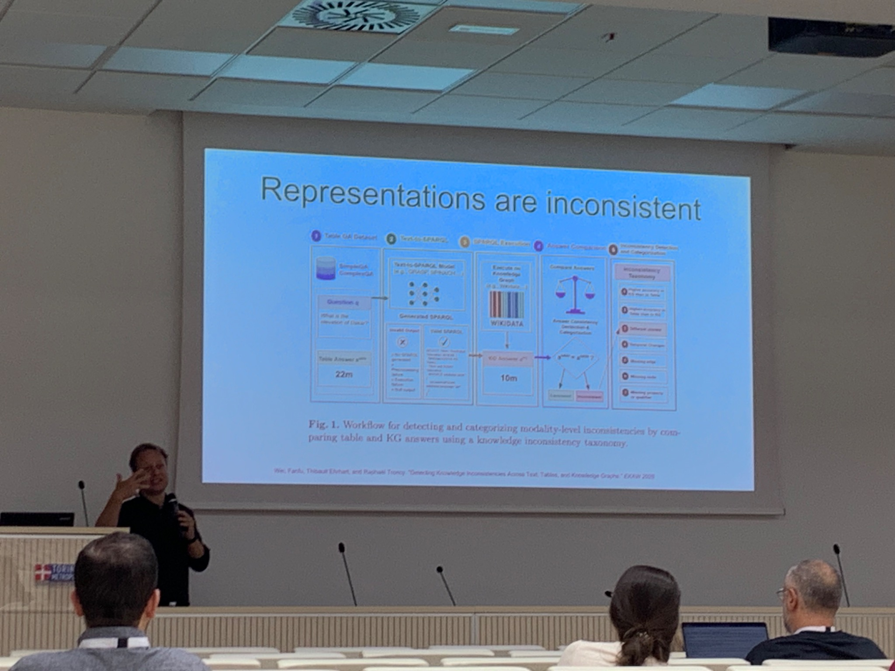

* **MARS: Multi-hop Adaptive Retrieval and SPARQL Generation for KGQA** - a new Text2SPARQL model.
  * Paper: <https://arxiv.org/abs/2607.14561>; code: <https://github.com/dice-group/mars-kgqa>
  * Fixed procedure, adaptive depth: entity linking -> retrieve and rank graph patterns -> LLM reasoning -> expand another hop or generate SPARQL.
  * Entity linking build based on GRASP.
  * It retrieves **patterns, not raw triples**, to keep the context small.
  * No dataset-specific fine-tuning; evaluated on QALD-9-plus, QALD-10 and LC-QuAD2.0.
  * Claim "outperforms GRASP in 8 of 14 head-to-head comparison", especially on QALD-10 and LC-QuAD2.0.
  * Fanfu's view based on concept: Mars is good for Text2SPARQL translation. Not good for KG incompleteness probing. Multi-hop approach only based on what's in the KG for the relevant entities. While zero-shot exploration could guess what incomplete structure should be based on other complete sub-graph.
  
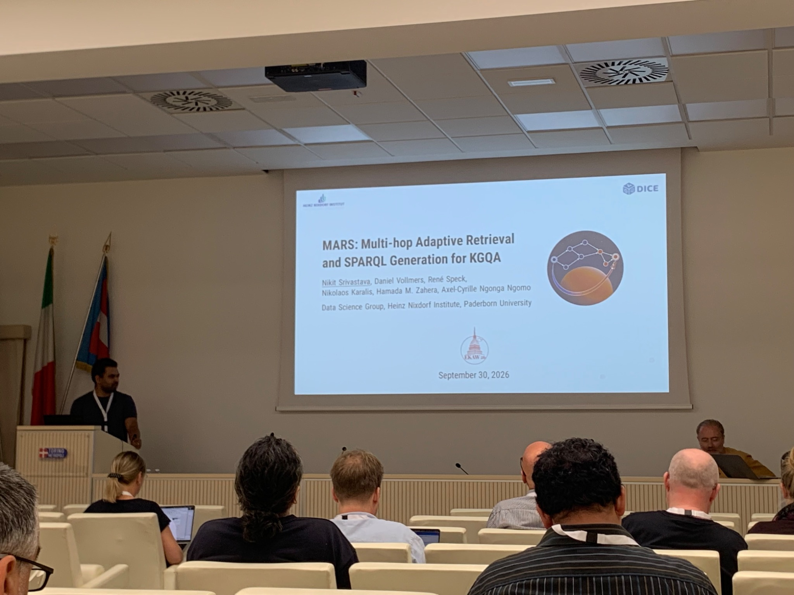

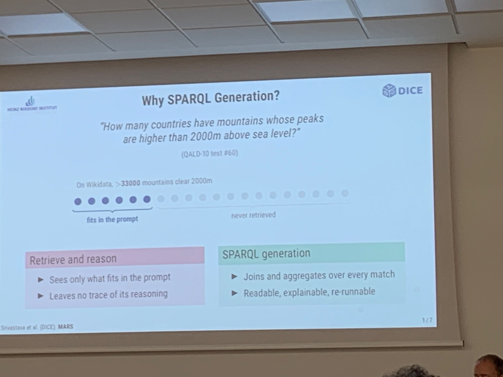

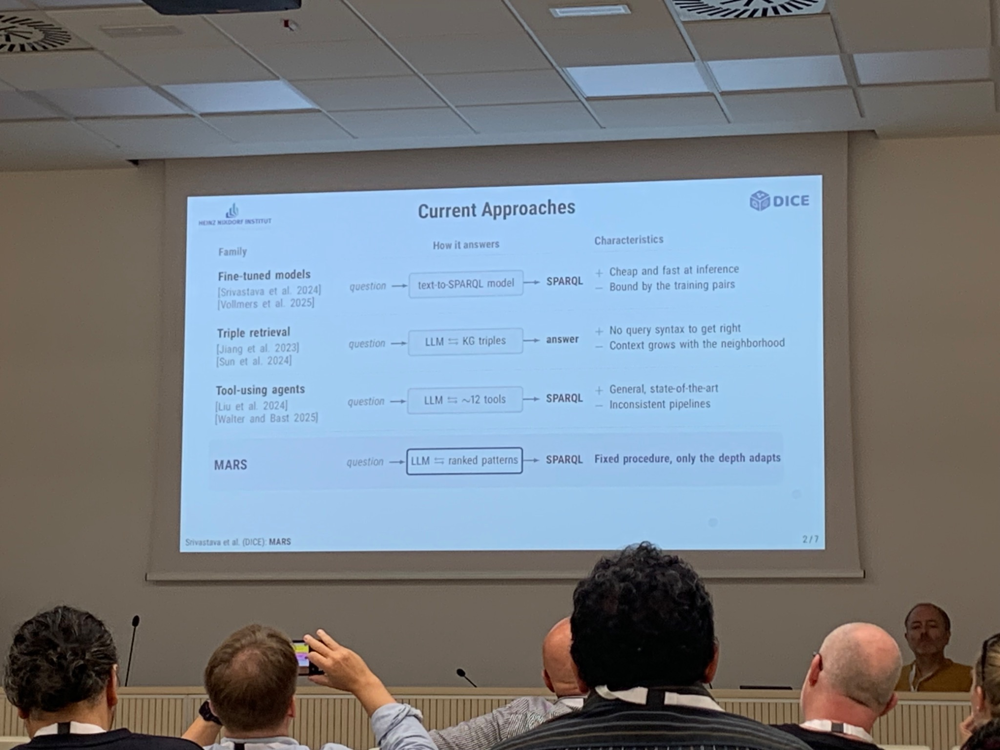

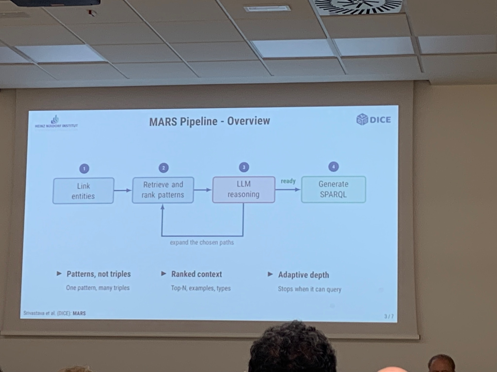

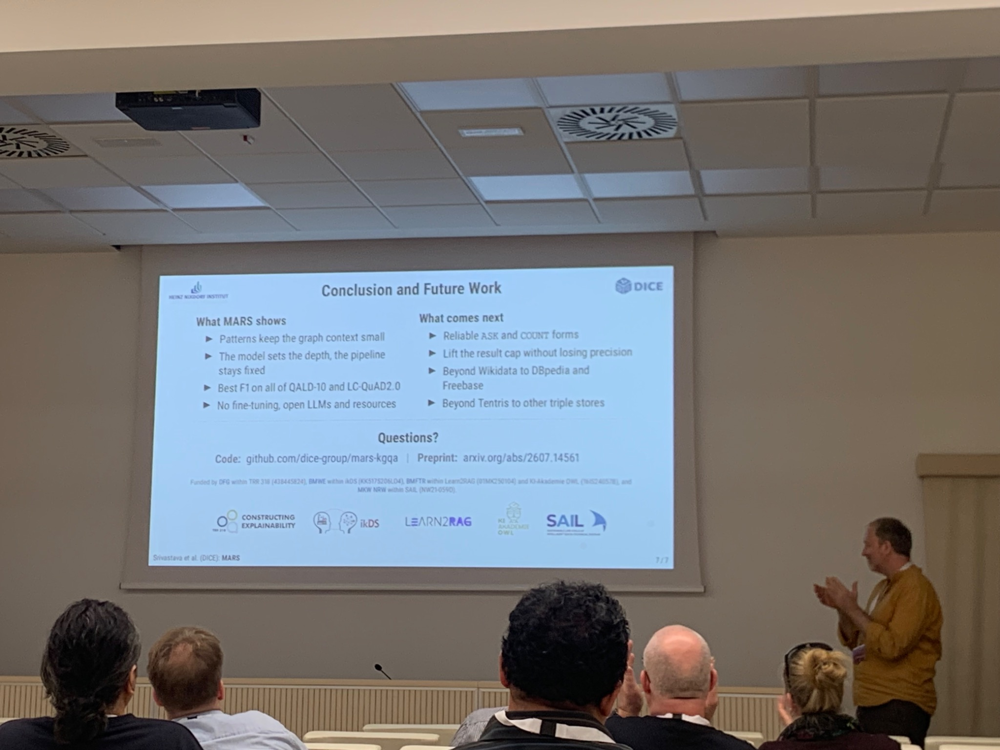

## September 29 - X-TAIL Workshop

* [X-TAIL: eXtraction and eXploitation of long-TAIL Knowledge with LLMs and KGs](https://www.xtail-workshop.org/)

### **Keynote: Rossana Damiano - Narrating Cultural Data: Opportunities and Challenges**

* Why storytelling? Compact, effective, memorable; also connected to identification, emotion and narrative self.
* Cultural data are sparse, fragmented and heterogeneous and often need historical / social / cultural context to become understandable.
* Citizen curation, intangible cultural heritage, remediation and interactivity were recurring themes.
* Typical museum-data pipeline: NER -> Entity Linking -> Relation Extraction.
* Data-to-story pipelines still need cleaning and much stronger human evaluation.

### **Long-tail knowledge from historical sources**

* Jude Majumdar and Delfi Sol Martinez Pandiani - *All Present, None Accounted For: Named Entity Extraction as Diagnostic for Long-Tail Knowledge in Historical Archives*.
  * Historical archives are a difficult long-tail setting: scanned / handwritten Dutch archives, noisy and unstructured text, rare entities.
  * Nice framing: use NER itself as a diagnostic for what current models fail to cover.
* Stella Verkijk and Piek Vossen - *ROBE: Reversed-Order-Biased-Experts for Extracting Extreme Long-tail Events in Historical Texts*.
* Sandro Gepiro Contaldo et al. - *MultiAgent-Constructed Knowledge Bases for Long-Tail Microbial Question Answering*.
* Tijn Donners and Franziska Pannach - *From Travelogue to Knowledge Graph: An End-to-End Pipeline with Open-Weight LLMs for 19th-Century Dutch Travel Narratives*.

### **Ontology card game with Max Willis**
* Missed [Playing with Meanings workshop](https://www.humanfactorsinsemantics.net/PwM3.html) but made it on dinner.
* Fun hands-on modelling exercise: concepts and relations can be replaced / mixed into the current model as the game evolves, as long as it can form a self-consistent story telling narrative.
* Ontology modelling is negotiated: people decide which concepts matter and how they relate.

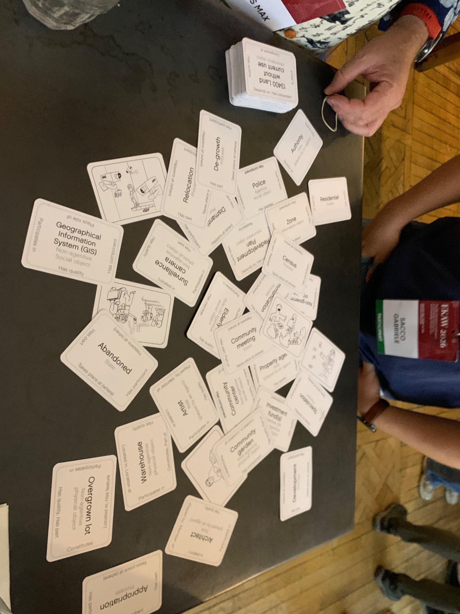

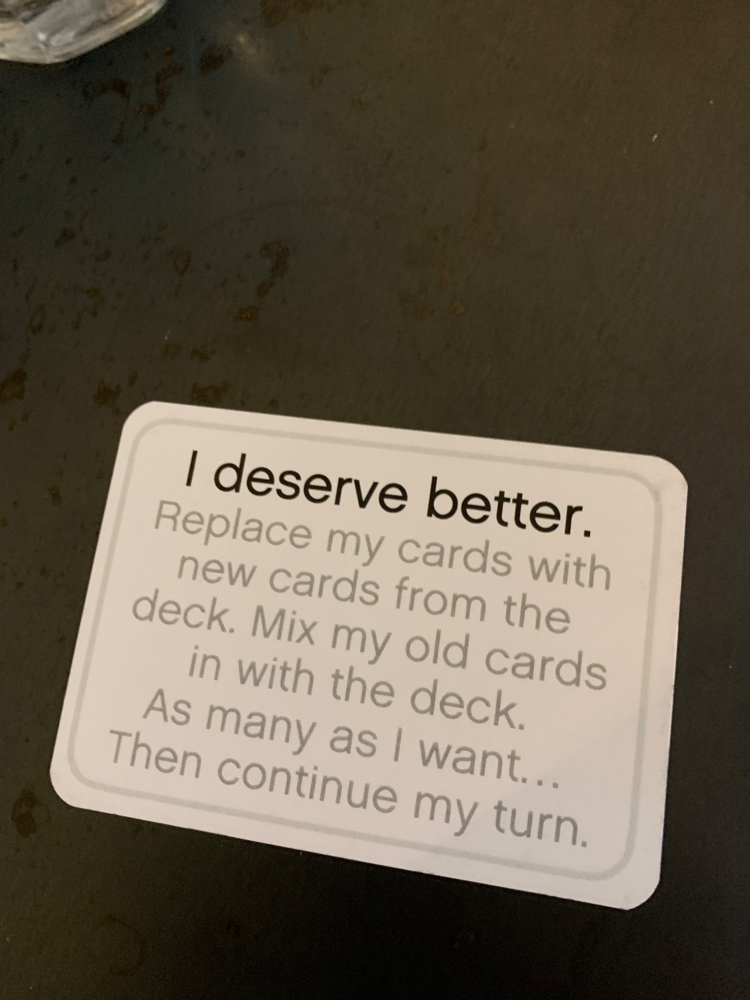

## September 30 - Main Conference Day 1

### **Opening**

* EKAW celebrated its 25th edition.
* Raphaël appeared in the anniversary testimonials: "a vibrant, welcoming community that made a young researcher feel he belonged, EKAW has a special place in his heart."
* The research-topic cloud was still dominated by **Knowledge Graphs**, with LLMs, Knowledge Engineering, Cultural Heritage, Ontology Engineering and Agentic AI also prominent.

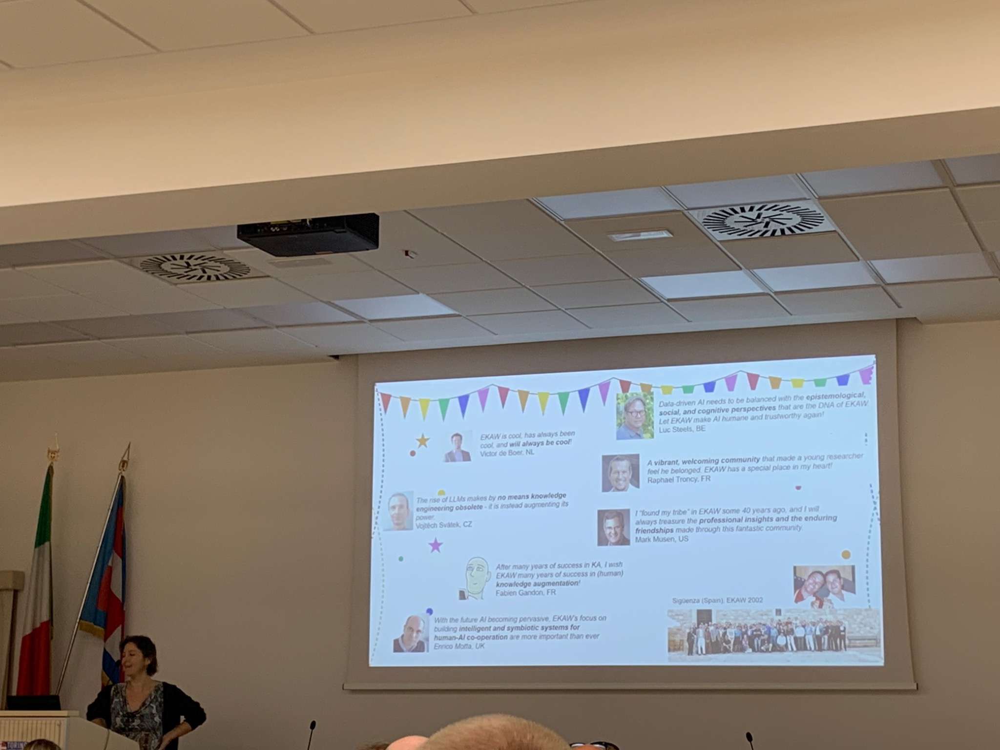

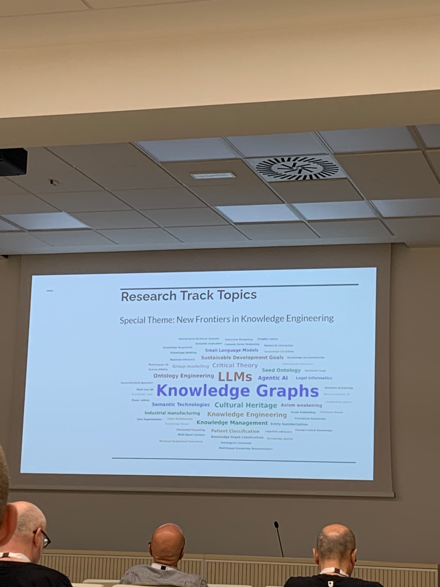

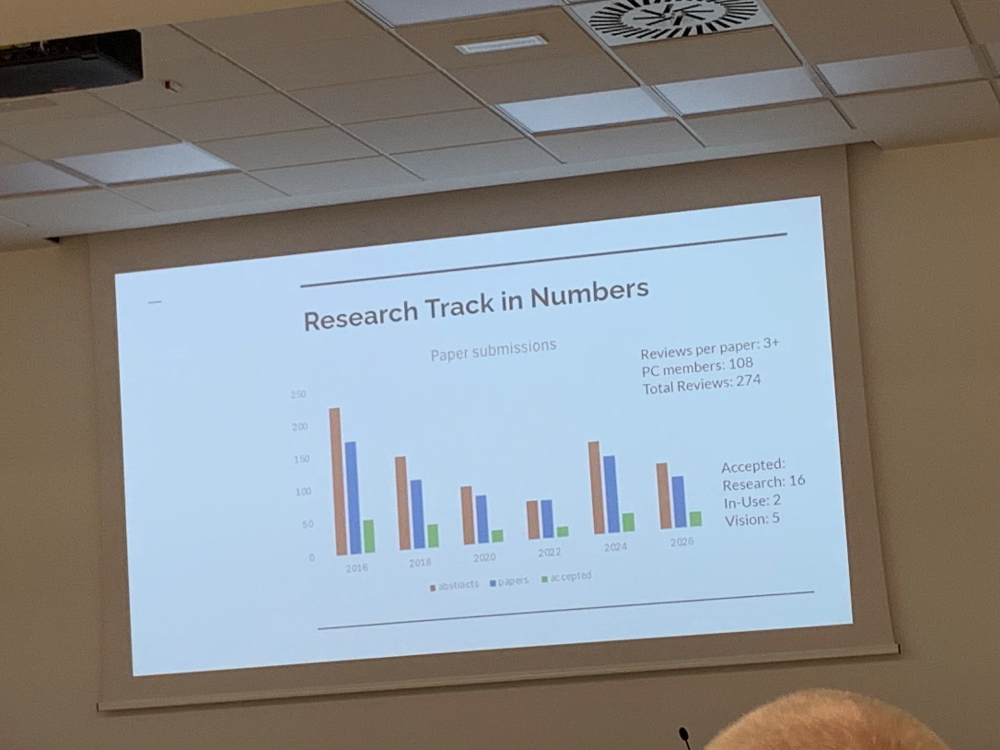

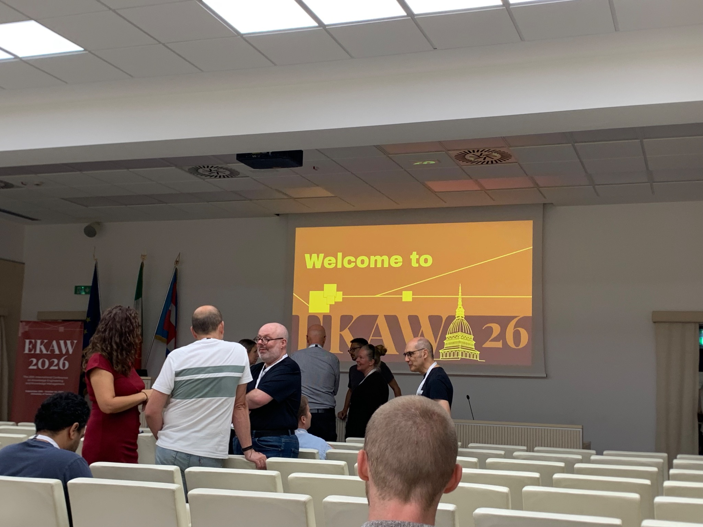

### **Keynote: Irene Celino - The Hitchhiker's Guide to Knowledge Engineering**

* Main warning: Knowledge Engineering should not become only a technical recipe for grounding GenAI.
* Strong line from the talk: **humans engage with purposes, not with conceptual modelling**.
* Domain experts are not knowledge engineers; KE should be embedded in activities that make sense to people.
* The talk moved through conceptualization, tacit knowledge, perspectives/conflicts, governance, automation and transformation.
* Recurrent idea: digital knowledge is useful only when it remains connected to human practices, purposes, interpretation and responsibility.
* Slides: <https://zenodo.org/records/23056753>

### **Session 2: Engineering Knowledge with Language Models**

* Virginia Ramón Ferrer et al. - *Easy to Say, Hard to Recover: Evaluating Structured Knowledge Preservation in Lightweight Language Models for Multilingual RDF-Text Cycles*.
  * RDF -> text is easier than text -> RDF.
  * Meaning is preserved better than exact structure.
  * Fine-tuning helps, but multilingual structural degradation remains uneven.
  * Best Research Paper nominee.

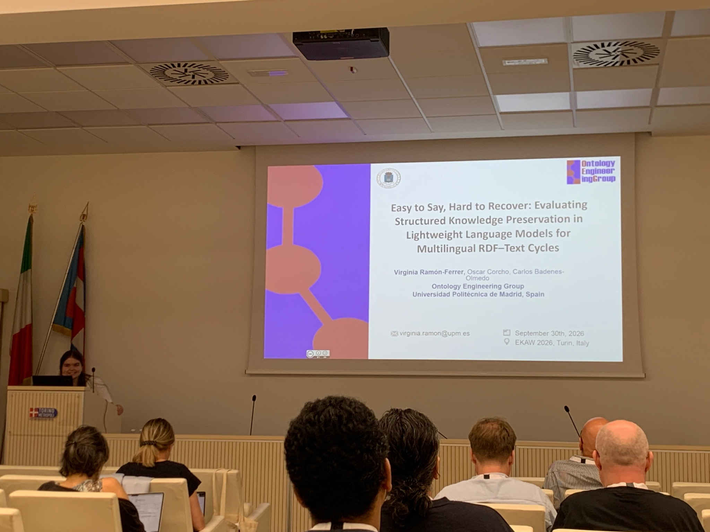

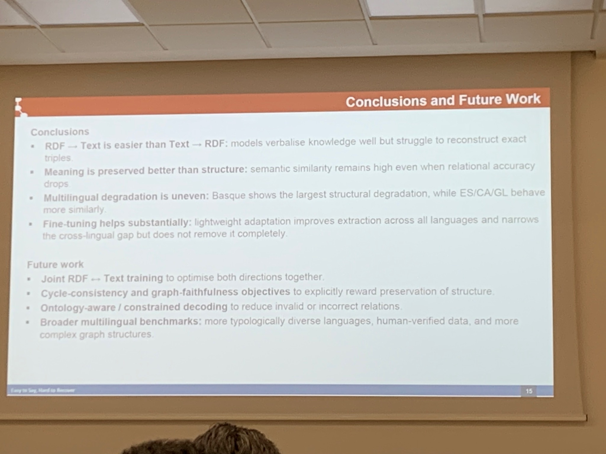

* Ruben Peeters et al. - *LLM-based Knowledge Graph Construction for Cultural Heritage: An Extraction-Failure Diagnostic and CIDOC-CRM Benchmark*.
  * Compared one-shot extraction with an agentic pipeline split into NER, coreference, entity linking, relation extraction and ontology mapping.
  * Added iterative validation / repair using DbC and SHACL.
  * Interesting because the work diagnoses **where KG construction fails**, not only the final triple score.

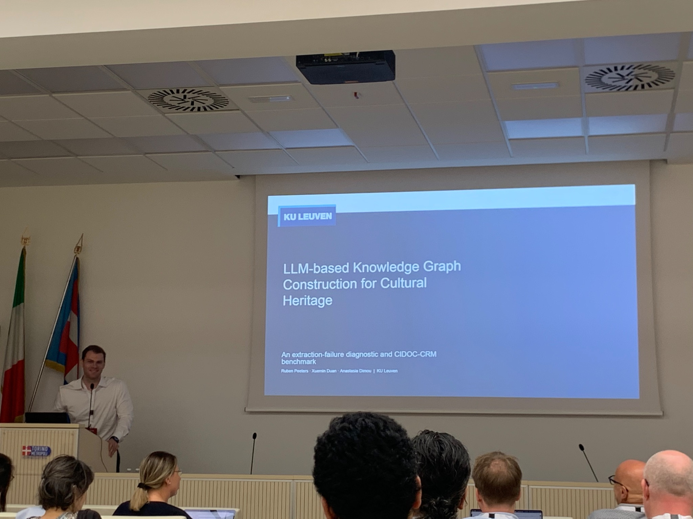

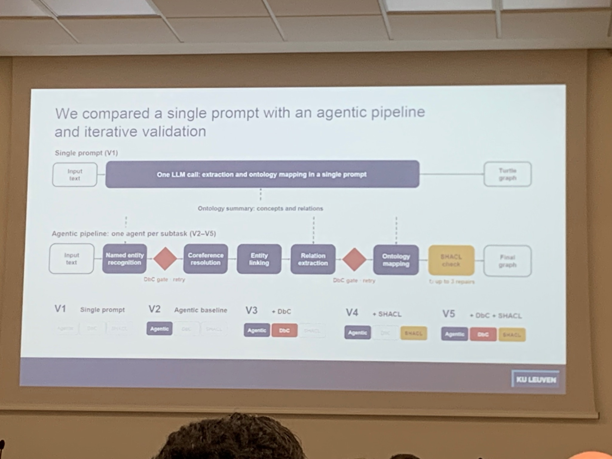

### **Session 3: Intelligent Question Answering and Knowledge Discovery**

* **MARS** - see the detailed note above. Best Research Paper nominee.

* Rachele Mignone et al. - *The Missing Link: Why Legal Large Language Models Need Knowledge Graphs*.
  * Broad argument for explicit structured legal knowledge to improve grounding, traceability and reasoning around legal LLMs.

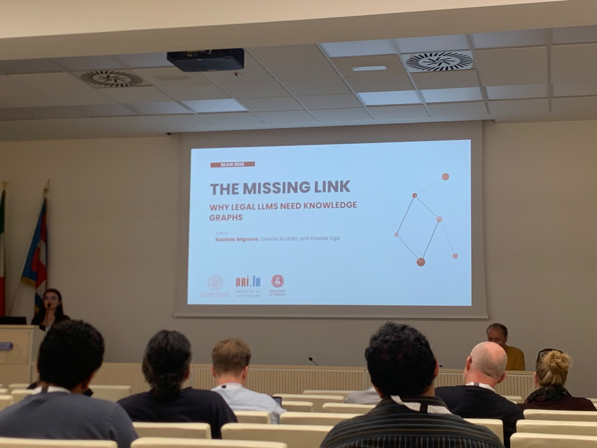

### **Session 4: Reasoning and Repair**

* Daira Pinto Prieto et al. - *Enabling Formal Epistemic Reasoning in Diagnostic Systems using Semantic Technologies*.
  * Epistemic context can guide diagnostic reasoning, but explicit epistemic logic is expensive to model and compute; Semantic Web technologies can mitigate part of the cost.

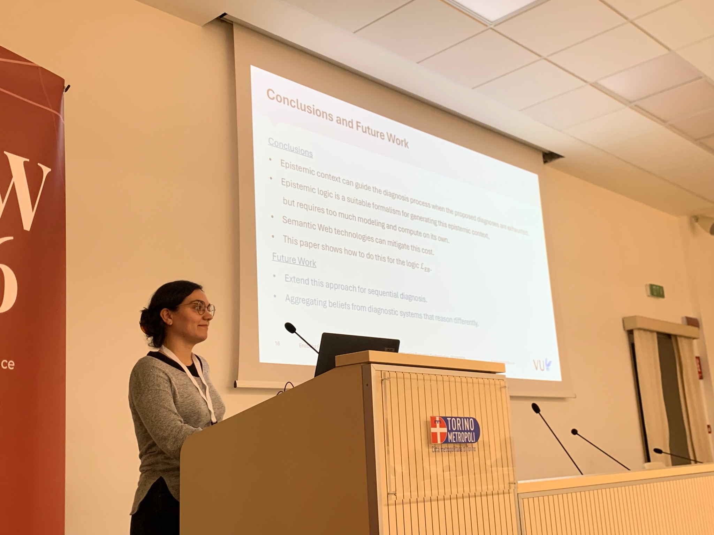

* José C. Oliveira et al. - *Guiding Ontology Repair with Axiom Weakening and Inconsistency Power Indices*.
* Siddharth Bhargava et al. - *Have You Been Convinced? A Neuro-symbolic Argumentation Reasoning Approach to Detecting Persuasiveness in ChangeMyView Discussions*.
* **Fanfu Wei et al. - KONTRAST** - my presentation; see the note at the top.

### **Posters / Demos**

* *Towards Automated Generation of Entity Graphs for Explaining False or Misleading Claims*.
  * LLMs generate structured entity graphs for fact-check explanations.
  * Useful direction, but relation / type modelling errors remain common.

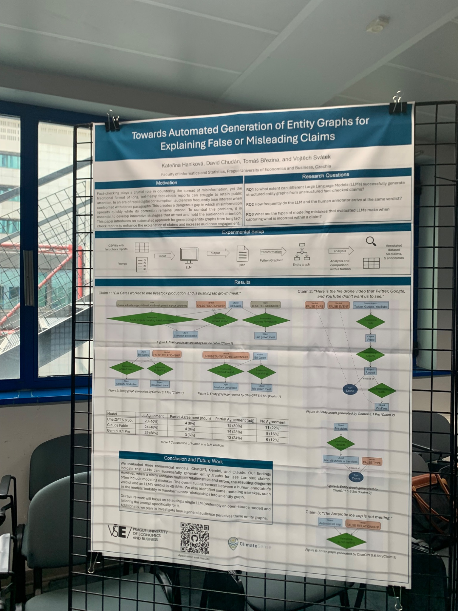

* *Deploying Sensemaking Robots in Healthcare Environments*.
  * Perception + ontology / KG reasoning + anomaly rules for blocked exits, spills, unauthorised access, etc.
  * Poster reports **61.6% precision on noisy real-world data vs 92% on synthetic data**.

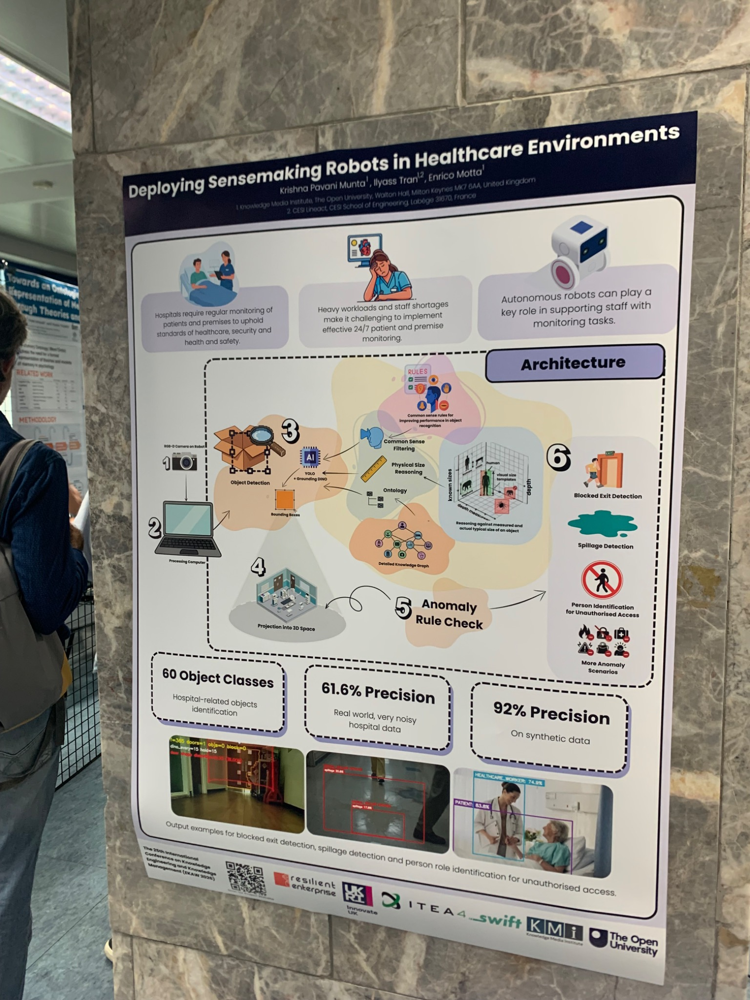

* **Spygame: Human-in-the-Loop Evaluation of Generated Knowledge Cues**.
  * 45 target public figures, 360 cues, 3,412 cue-level interactions.
  * A cue can be factually correct and fluent but still be useless because it is vague, obvious or ambiguous.
  * Good example of evaluating generated knowledge **in use**, through observable human reasoning behaviour.

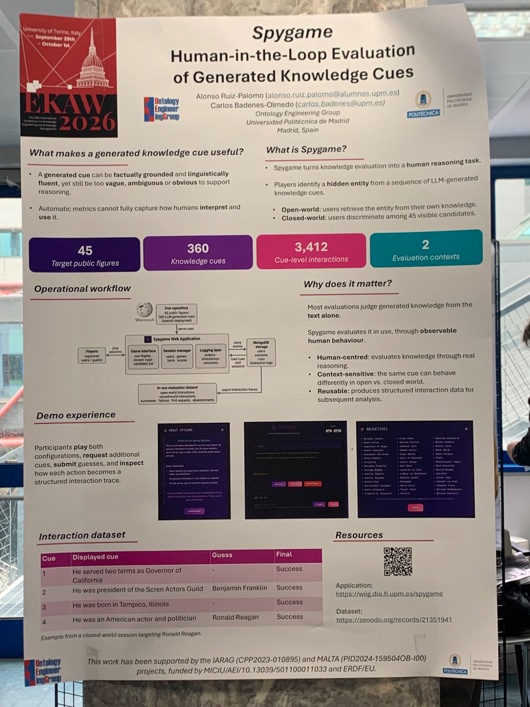

* *Encoding Guideline Disagreement as First-Class Knowledge*.
  * Very relevant conceptual point: disagreement / provenance can be explicitly represented instead of collapsed into one "correct" decision.

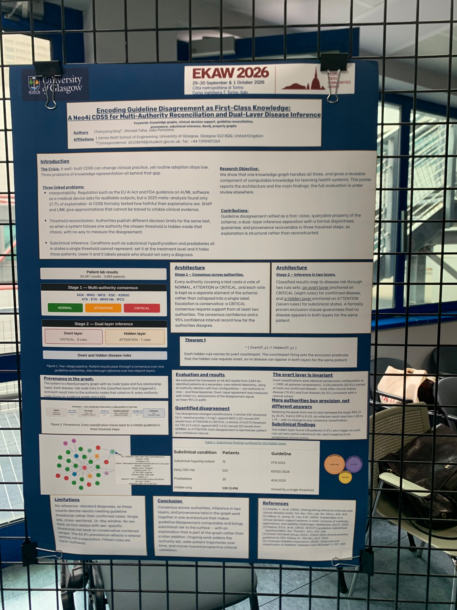

* *Towards Rich Data Queries From Schema Diagrams*.
  * ViziQuer generates SPARQL through a graphical interface; the multicardinal table avoids Cartesian-product duplication for multi-valued properties.

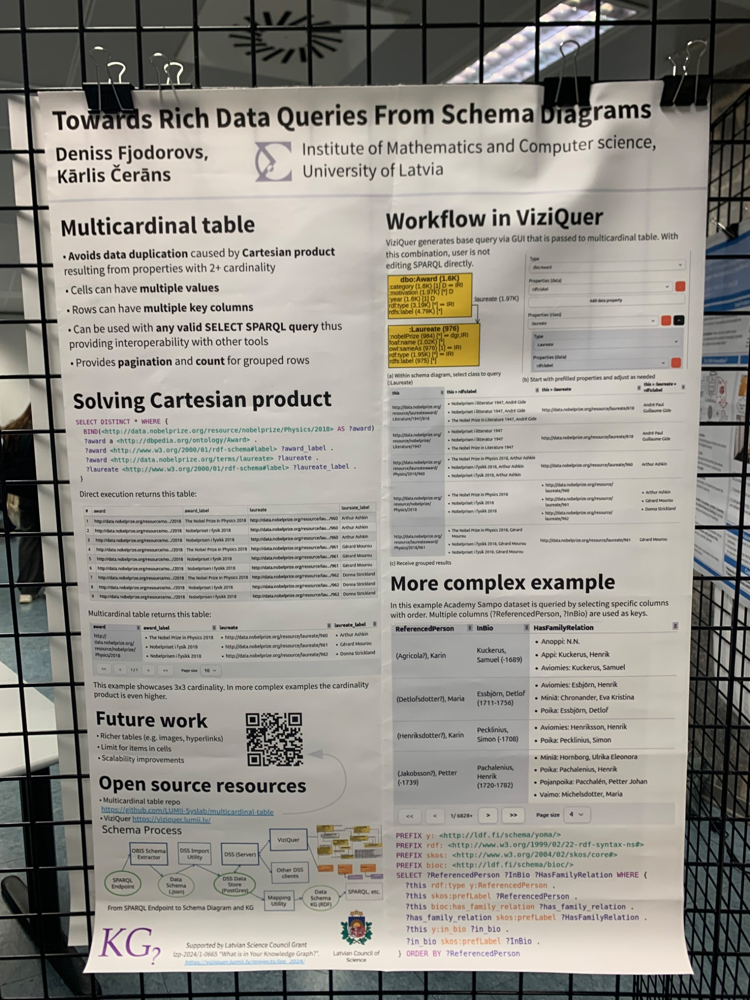

* **WebNLG-IR: Triple, Text, and Hybrid Retrieval over Multilingual Knowledge Graphs**.
  * 35,616 queries; compares multiple retrieval methods across triples, text and hybrid representations.
  * Main takeaway: triples and verbalized text provide complementary signals; **triples + verbalized text** works best.

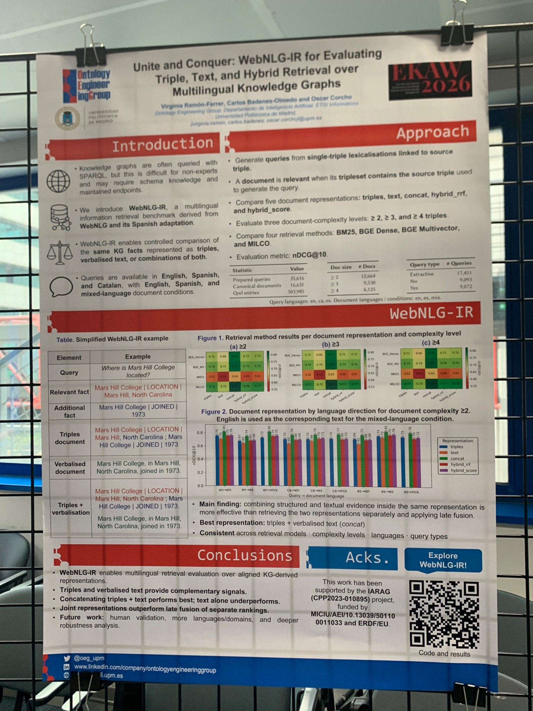

## October 1 - Main Conference Day 2

### **Keynote: Paul Groth - The Knowledge Placement Problem**

* Paul explicitly framed the keynote as **raising questions rather than answering them**.
* Core question: where should knowledge live - model weights, context, retrieval index, agent memory, KG/database, tools, or people?
* LLMs make it easier to move knowledge between representations, but every transformation can be costly and lossy.
* **Requirements shape placement**: mutability, verifiability, attribution, composition, capacity, read/write behaviour, workload and time all matter.
* Nice research-assistant example:
  * document store -> versioned source and context;
  * retrieval index -> passages linked to source versions;
  * KG -> qualified claims, sources and dependencies;
  * agent memory -> temporary working conclusions.
* **Provenance is a key building block**: trace sources, transformations, placements and downstream uses so that corrections can propagate.
* KGs may be the **connective tissue** across heterogeneous stores rather than the only place where knowledge lives.
* Sequence most relevant to us: multimodal knowledge -> multimodal tables -> multiple useful representations -> **representations are inconsistent (KONTRAST)** -> knowledge changes over time (**EMERGE**).
* Conclusion: foundation models do not reduce the scope of Knowledge Engineering; they make the playground much bigger.

### Random notes from Paul's keynote:

* **EMERGE: A Benchmark for Updating Knowledge Graphs with Emerging Textual Knowledge** - Study dynamic knowledge management, how to update KG:
  * Paper: <https://arxiv.org/abs/2507.03617>; code: <https://github.com/klimzaporojets/emerge>
  * Accepted at NeurIPS 2026 Datasets & Benchmarks.
  * The problem is not only extracting facts from text, but deciding how new textual evidence should **change the current KG state**.
  * Operations include **Exists, Add, Mint+Add, Infer, Deprecate**.
  * Natural continuation after KONTRAST: detect disagreement -> understand temporal change -> decide whether / how the KG should be updated.

* [PixelRAG](https://pixelrag.ai/) -Search Wikipedia by what it looks like. Visual search for Wikipedia.
* [Never-Ending Learning for Agentic AI Systems tutorial](https://megagon.ai/agentic_tutorial2026/) - useful for dynamic knowledge, drift, memory and continuously changing systems.

### **Session 6: New Frontiers in Knowledge Engineering - Vision & Horizons**

  * Vison session:The Road to Knowledge Hell is Paved with AI Good Intentions: <https://zenodo.org/records/23105007>

* Very nice **fishbowl discussion**: participants sit around 4-5 central chairs; to join, you tap someone in the middle and replace them.
* Terry Payne - *Discoverable Agent Knowledge - A Formal Framework for Agentic KG Affordances*.
  * We need to describe not just what a KG contains, but what an agent can actually do with it.
  * Interesting connection to our MCP direction: an agent should know the affordances / limits of a KG before querying it.
* Greta Adamo / Max Willis - justice and sustainability modelling.
  * Important point from the discussion: start modelling from the perspective of vulnerable subjects, not only what is technically convenient.
* Enrico Daga - *Knowledge Graph Re-engineering Along the Ontological Continuum*.
  * A more principled way to move between KGs with different modelling commitments.
* Irene Celino - *The Road to Knowledge Hell is Paved with AI Good Intentions*.
  * **Knowledge always remains human**: formalization does not remove tacit experience, interpretation or situated judgement.
  * Human Knowledge Interaction (HKI): knowledge form, cognitive processes, hybrid systems.
  * Research directions: evaluation of digital knowledge, human-AI entanglement, governance of autonomous knowledge use.
* Stefan Schlobach / Neal Harris / Pascal Hitzler - *Dialectics of Knowledge* / Critical Symbolic AI.
  * Broader point: KE needs room for disagreement, competing perspectives and social-science viewpoints.

### **Session 7: Socio-technical aspects of Knowledge Engineering**

* Recurring theme: **the role of humans in knowledge modelling** - who defines entities, identifiers, exceptions and boundaries, and what gets lost when these choices are formalized?
* Zeno van Cauter et al. - qualitative study of entities / identifiers / identification in industrial manufacturing.
* Alonso Ruiz-Palomo and Carlos Badenes-Olmedo - **QUILL**: evaluate whether LLM-generated knowledge cues actually help human deductive reasoning.
* Gabriele Sacco et al. - *Formal and Human Reasoning with Exceptions*.
* Anna Wróbel, Elia Meregalli and Stefan Schlobach - *How to unravell implicit power relations in symbolic AI research*.
  * **Best Research Paper Award**.
  * Strong reminder that modelling is not neutral; broader perspectives are needed, including social-science perspectives.

### **Session 8: Knowledge Engineering in Practice**

* Mario Scrocca et al. - *End-to-end Procedural Knowledge Management in Industry 5.0 with AI-in-the-loop*.
  * Connects human procedural knowledge, symbolic representations and AI support in an industrial setting.
* Michele Colombino et al. - *Enriching Cultural Heritage Knowledge Graphs from Historical Travel Narratives*.
  * Another concrete example of extracting structured knowledge from historical narrative sources, connecting back to X-TAIL.

### **Awards**

* Best Research Paper nominees:
  * *Easy to Say, Hard to Recover: Evaluating Structured Knowledge Preservation in Lightweight Language Models for Multilingual RDF-Text Cycles*
  * **MARS: Multi-hop Adaptive Retrieval and SPARQL Generation for KGQA**
  * **Winner:** *How to unravell implicit power relations in symbolic AI research*

## Main Takeaways for ECLADATTA

* **KONTRAST -> EMERGE feels like a natural progression**: inconsistency detection tells us *where representations disagree*; dynamic KG updating asks *what should change next*.
* **Text-to-SPARQL is moving toward constrained / structured exploration**, as illustrated by MARS. This is directly useful when positioning GRASP and our MCP approach.
* **Representation choice is part of the research problem**: text, tables, images, KGs, retrieval indexes and model parameters each preserve different things.
* **Provenance + time should become first-class** if we want to move from detecting differences toward maintaining reliable knowledge.
* The socio-technical discussions were a useful counterweight: a technically consistent KG is not automatically the right representation of reality, and disagreement is not always an error to remove.

---

---

# Visual Appendix

The ZIP keeps **all conference photos**. Full slide decks are linked on Zenodo instead of being bundled locally, to keep the archive lightweight.

## A. Complete Photo Log

### EKAW anniversary testimonials, including Raphaël Troncy.

### Research-track topic cloud: Knowledge Graphs, LLMs, Knowledge Engineering and related themes.

### Opening-room atmosphere at EKAW 2026.

### Easy to Say, Hard to Recover - conclusions and future work.

### Easy to Say, Hard to Recover - title slide.

### LLM-based Knowledge Graph Construction for Cultural Heritage - title slide.

### Agentic KG-construction pipeline with validation and SHACL checks.

### The Missing Link: Why Legal LLMs Need Knowledge Graphs.

### Formal epistemic reasoning for diagnostic systems - conclusions and future work.

### Poster: entity graphs for explaining false or misleading claims.

### Poster: deploying sensemaking robots in healthcare environments.

### Poster: Spygame - human-in-the-loop evaluation of generated knowledge cues.

### Poster: encoding guideline disagreement as first-class knowledge.

### Poster: rich data queries from schema diagrams / ViziQuer.

### Poster: WebNLG-IR - triple, text and hybrid retrieval over multilingual KGs.

## B. Slide Decks (external links)

* Zenodo: <https://zenodo.org/records/23056753>
* Zenodo: <https://zenodo.org/records/23105007>
* Zenodo: <https://zenodo.org/records/23081694>

